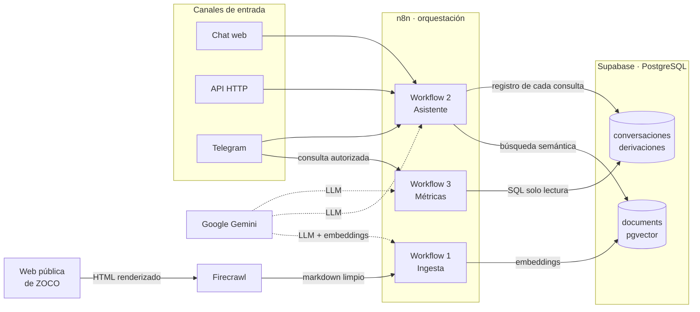

# Asistente Inteligente de ZOCO Pagos

Agente conversacional que responde consultas sobre los productos y servicios
de ZOCO Pagos usando exclusivamente información pública del sitio oficial.
Recupera el contexto por búsqueda semántica, cita la fuente de cada respuesta
y deriva a un asesor humano cuando no tiene el dato.

## Stack

| Componente | Tecnología |
|---|---|
| Orquestación | n8n |
| Scraping | Firecrawl |
| Base vectorial y logs | Supabase (PostgreSQL + pgvector) |
| Canales | Chat web, API HTTP, Telegram |

### Modelos

| Uso | Modelo |
|---|---|
| Agentes conversacionales (general y precios) | `models/gemini-3.5-flash` |
| Analista de métricas | `models/gemini-3.5-flash` |
| Clasificador de intención | `models/gemini-2.5-flash` |
| Embeddings | `models/gemini-embedding-001` (3072 dimensiones) |

El clasificador corre sobre un modelo más liviano a propósito: elegir entre
seis categorías es una tarea acotada que no justifica el costo ni la latencia
del modelo que responde. Los agentes, que además ejecutan herramientas y
razonan sobre el contexto recuperado, sí usan el modelo mayor.

## Diagrama de Arquitectura

## Requisitos previos

| Servicio | Para qué se usa | Qué hay que obtener |
|---|---|---|
| [n8n](https://n8n.io) | Orquestación de los tres workflows | Instancia local o alojada |
| [Supabase](https://supabase.com) | Base vectorial, logs y métricas | Proyecto nuevo (plan Free) |
| [Firecrawl](https://firecrawl.dev) | Scraping con renderizado de JavaScript | API key |
| [Google AI Studio](https://aistudio.google.com) | Gemini: LLM y embeddings | API key |
| [Telegram BotFather](https://t.me/botfather) | Bot del panel de métricas y chat | Token (un solo bot) |

Firecrawl no es intercambiable por un fetch simple: las preguntas frecuentes
del sitio viven dentro de acordeones que se montan por JavaScript, así que sin
renderizado ese contenido no existe en el HTML.
Un solo bot de Telegram cubre los dos usos. El `Telegram Trigger` vive en el
workflow del asistente; cuando el clasificador detecta una consulta de
métricas, rutea al sub-workflow, que responde por el mismo bot. Un único
webhook registrado, sin conflicto.

> Ninguna clave está en este repo. Todas se cargan como credenciales de n8n y
> los JSON sólo guardan su ID interno.

## Instalación desde cero

### 1 · Levantar n8n

```bash
docker volume create n8n_data

docker run -it --rm --name n8n -p 5678:5678 \
  -v n8n_data:/home/node/.n8n \
  docker.n8n.io/n8nio/n8n
```

El editor queda en `http://localhost:5678`. El volumen guarda workflows,
credenciales y la clave de encriptación, así que sobrevive a reinicios.

<details>
<summary>Instalar Docker en Ubuntu / Pop!_OS</summary>

El script de `get.docker.com` puede detectar mal la distribución. Conviene
usar los repositorios del sistema:

```bash
sudo apt install docker.io docker-compose-v2
sudo systemctl enable --now docker
sudo usermod -aG docker $USER
```

El cambio de grupo toma efecto al volver a iniciar sesión.
</details>

Telegram necesita una URL pública para entregar los mensajes. Agregando
`start --tunnel` al final del comando, n8n levanta un túnel y muestra la URL
al arrancar. Es una herramienta de desarrollo, no de producción.

---

### 2 · Base de datos

Crear un proyecto en Supabase y ejecutar en el SQL Editor, en orden.

**2.1 Extensión y base de conocimiento**

```sql
create extension if not exists vector;

create table documents (
  id        bigserial primary key,
  content   text,
  metadata  jsonb,
  embedding vector(3072)
);
```

> La dimensión **3072** corresponde a `gemini-embedding-001`. Si se cambia el
> modelo de embeddings hay que recrear la tabla con la dimensión nueva y
> volver a ingestar.

**2.2 Función de búsqueda por similitud**

Es la que consulta el nodo Vector Store de n8n para recuperar los fragmentos
más parecidos a la pregunta del usuario.

```sql
create or replace function public.match_documents (
  query_embedding vector,
  match_count integer default null,
  filter jsonb default '{}'::jsonb
) returns table (
  id bigint,
  content text,
  metadata jsonb,
  similarity double precision
)
language plpgsql
as $function$
#variable_conflict use_column
begin
  return query
  select
    id,
    content,
    metadata,
    1 - (documents.embedding <=> query_embedding) as similarity
  from documents
  where metadata @> filter
  order by documents.embedding <=> query_embedding
  limit match_count;
end;
$function$;
```


**2.3 Tablas de observabilidad**

```sql
create table conversaciones (
  id         bigserial primary key,
  creado_en  timestamptz default now(),
  session_id text,
  canal      text,      -- 'chat' | 'api' | 'telegram'
  intencion  text,      -- 'consultas' | 'precios' | 'humano' | 'otro'
  pregunta   text,
  respuesta  text,
  derivado   boolean default false
);

create table derivaciones (
  id         bigserial primary key,
  creado_en  timestamptz default now(),
  session_id text,
  consulta   text,
  motivo     text
);
```

**2.4 Usuario de solo lectura para el panel de métricas**

```sql
create user metricas_bot with password 'ELEGIR_UNA_PASSWORD_LARGA';

grant usage on schema public to metricas_bot;
grant select on public.conversaciones, public.derivaciones to metricas_bot;
alter role metricas_bot set search_path to public;

create policy "metricas_bot lectura" on public.conversaciones
  for select to metricas_bot using (true);

create policy "metricas_bot lectura" on public.derivaciones
  for select to metricas_bot using (true);
```

Las políticas RLS son necesarias: Supabase activa Row Level Security por
defecto y sin ellas el usuario ve cero filas aunque tenga el `GRANT`.

---

### 3 · Credenciales

En n8n: **Credentials → Add credential**. Son cuatro.

**Supabase API**

| Campo | Valor |
|---|---|
| Host | `https://<project-ref>.supabase.co` |
| Secret Key | la `service_role` key (Project Settings → API Keys) |

> Usar la `service_role`, no la `anon`: el asistente necesita escribir en las
> tablas de logs. Si el proyecto es nuevo y no aparecen las *legacy keys*,
> corresponde una *Secret API key* del esquema actual.

**Google Gemini(PaLM) API**

La API key de [AI Studio](https://aistudio.google.com/apikey). El Base URL
viene con el valor correcto y no se toca.

**Postgres** — para el panel de métricas

La conexión directa de Supabase resuelve sólo por IPv6. Si n8n corre en una
red IPv4 hay que usar el **Session pooler** (Supabase → Connect):

| Campo | Valor |
|---|---|
| Host | `aws-1-<region>.pooler.supabase.com` |
| Database | `postgres` |
| User | `metricas_bot.<project-ref>` |
| Password | la del paso 2.4 |
| Port | `6543` |
| Max Connections | `5` |

> Con el pooler, el usuario lleva el project-ref pegado con un punto.

**Telegram API**

El token que devuelve [@BotFather](https://t.me/botfather) al crear el bot
con `/newbot`. Un solo bot cubre asistente y métricas.

**Firecrawl** no es una credencial de tipo propio: en el nodo `Scraper Web`
se configura como *Generic Credential Type → Header Auth*, con nombre
`Authorization` y valor `Bearer <api-key>`.

---

### 4 · Importar los workflows

**Workflows → Import from File**, uno por uno:

| Archivo | Workflow |
|---|---|
| `workflows/1-ingesta.json` | Agente Ingesta ZOCO |
| `workflows/2-asistente.json` | Agente Conversacional |
| `workflows/3-metricas.json` | Métricas |

Después de importar, abrir cada nodo marcado en rojo y **asignar la
credencial** correspondiente. Los IDs del repo no existen en otra instancia.

Tres cosas más que hay que ajustar a mano:

1. **Sub-workflow de métricas.** En `Agente Conversacional`, el nodo
   `Metricas` referencia el workflow por ID. Abrirlo y volver a seleccionar
   el workflow `Métricas` recién importado.
2. **Chat ID autorizado.** En `Métricas`, el nodo `If` valida contra una
   lista de Chat IDs. Reemplazar por el propio: se obtiene mandándole
   cualquier mensaje al bot y mirando el INPUT del `Telegram Trigger`.
3. **Header de Firecrawl.** Verificar que la credencial Header Auth quedó
   asignada en el nodo `Scraper Web`.

---

### 5 · Primera ingesta y verificación

Abrir **Agente Ingesta ZOCO** y ejecutar desde el `Disparador Manual`. Toma
entre uno y dos minutos.

```sql
-- Las 5 URLs deben estar presentes
select metadata->>'url' as url, count(*)
from documents group by 1 order by 1;

-- Debe dar 0: no quedó basura codificada del footer
select count(*) from documents where content like '%20d=%';

-- Deben ser 10 las preguntas frecuentes del home
select count(*) from documents where metadata->>'tipo' = 'faq';
```

Con eso verificado, poner los tres workflows en **Active**. La ingesta pasa a
correr semanalmente y el asistente queda disponible en su URL pública.

## Uso

### Chat web

La URL aparece en el nodo `When chat message received` con el workflow
publicado.

Preguntas de ejemplo:

- ¿Qué medios de pago acepta ZOCO?
- ¿Necesito internet para usar el POS?
- ¿Puedo usarlo siendo monotributista?
- ¿Cuánto tarda en acreditarse una venta?

### API

```bash
curl -X POST https://<tu-n8n>/webhook/zoco-agente \
  -H "Content-Type: application/json" \
  -d '{"chatInput": "¿qué tarjetas acepta el POS?", "sessionId": "cliente-123"}'
```

```json
{ "output": "Con la terminal de ZOCO aceptás todas las principales tarjetas locales e internacionales… [Fuente: https://www.zocopagos.com/]" }
```

Repitiendo el mismo `sessionId` en llamadas sucesivas se mantiene el
contexto de la conversación.

### Telegram

El mismo bot atiende consultas del asistente y, para chats autorizados,
consultas de métricas.

### Panel de métricas

Preguntas en lenguaje natural sobre el uso del asistente:

```
¿cuántas consultas hubo hoy?
¿qué tipo de consultas son las más frecuentes?
¿qué porcentaje terminó derivada a un asesor?
mostrame las últimas preguntas que no pudo responder
```

El acceso está restringido por Chat ID de Telegram: un usuario no autorizado
recibe un mensaje de acceso denegado. La validación ocurre en un nodo `If`,
antes de que intervenga el modelo.

### Consultas directas a la base

```sql
-- volumen por tipo de intención
select intencion, count(*) from conversaciones group by 1 order by 2 desc;

-- tasa de derivación
select round(100.0 * count(*) filter (where derivado) / count(*), 1) as pct
from conversaciones;

-- qué se pregunta y el asistente no puede responder
select consulta, motivo from derivaciones order by creado_en desc limit 20;
```

### Actualizar la base de conocimiento

Corre sola los lunes a las 3 AM. A demanda, ejecutar **Agente Ingesta ZOCO**
desde el `Disparador Manual`.

## Cobertura de requisitos

### Desafío

| # | Requisito | Dónde se resuelve |
|---|---|---|
| 1 | Obtener automáticamente información desde la web de ZOCO | Workflow 1: Firecrawl sobre 5 URLs, con ejecución de JS para abrir los acordeones de FAQs |
| 2 | Construir una base de conocimiento | `documents` en Supabase/pgvector, chunking semántico por FAQ y por sección |
| 3 | Interfaz de chat | Chat web de n8n, más API HTTP y Telegram |
| 4 | Responder usando únicamente las fuentes recuperadas | Ambos agentes responden sólo con lo que devuelve `buscar_informacion_zoco` |
| 5 | Indicar cuando no posee información suficiente | Lo declara y registra el caso en `derivaciones` |
| 6 | Mantener contexto durante la conversación | Memoria compartida entre los dos agentes, con sesión por canal |
| 7 | Registrar qué fuente usó en cada respuesta | Cita `[Fuente: URL]` desde los metadatos del chunk; queda además en `conversaciones` |

### Requisitos adicionales

Se pedían 3. Implemente 6:

| Requisito | Implementación |
|---|---|
| Actualización automática | Schedule semanal con borrado previo (full refresh) |
| Memoria conversacional | `Simple Memory` compartida, con sesión por usuario y canal |
| Clasificación de intención | Text Classifier con 6 categorías, cada una con su rama |
| Fallback a atención humana | Tool `derivar_a_asesor` + rama explícita; registra en `derivaciones` y ofrece contacto |
| Métricas de consultas | Tabla `conversaciones` + agente text-to-SQL en Telegram |
| Webhook/API | Endpoint POST que acepta `chatInput` y `sessionId` y devuelve JSON |

No implemente: panel simple de conversaciones  y evaluación automática de
respuestas.

### Caso incómodo

> *"Decime exactamente cuánto me van a cobrar mañana por vender $500.000 en 12 cuotas."*

El clasificador rutea la consulta a un agente con una regla dominante que le
prohíbe calcular cifras. La respuesta explica de qué depende el costo según
las fuentes, aclara que el simulador de ZOCO usa tasas de demostración que no
incluyen impuestos ni retenciones, y deriva a un asesor registrando el caso.

Resiste también las dos variantes difíciles: la insistencia
(*"tirame un número aproximado"*) y el cálculo asistido
(*"vi que débito es 3,19%, ¿entonces por $100.000 me cobran $3.190?"*).
