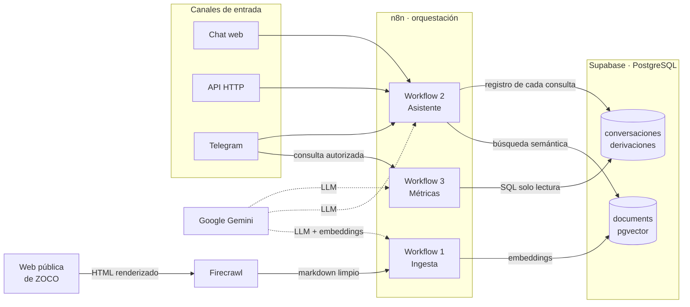

# Asistente Inteligente de ZOCO Pagos

Agente conversacional que responde consultas sobre los productos y servicios
de ZOCO Pagos usando exclusivamente información pública del sitio oficial.
Recupera el contexto por búsqueda semántica, cita la fuente de cada respuesta
y deriva a un asesor humano cuando no tiene el dato.

## Stack

| Componente | Tecnología |
|---|---|
| Orquestación | n8n |
| Scraping | Firecrawl |
| Base vectorial y logs | Supabase (PostgreSQL + pgvector) |
| Canales | Chat web, API HTTP, Telegram |

### Modelos

| Uso | Modelo |
|---|---|
| Agentes conversacionales (general y precios) | `models/gemini-3.5-flash` |
| Analista de métricas | `models/gemini-3.5-flash` |
| Clasificador de intención | `models/gemini-2.5-flash` |
| Embeddings | `models/gemini-embedding-001` (3072 dimensiones) |

El clasificador corre sobre un modelo más liviano a propósito: elegir entre
seis categorías es una tarea acotada que no justifica el costo ni la latencia
del modelo que responde. Los agentes, que además ejecutan herramientas y
razonan sobre el contexto recuperado, sí usan el modelo mayor.

## Diagrama de Arquitectura

